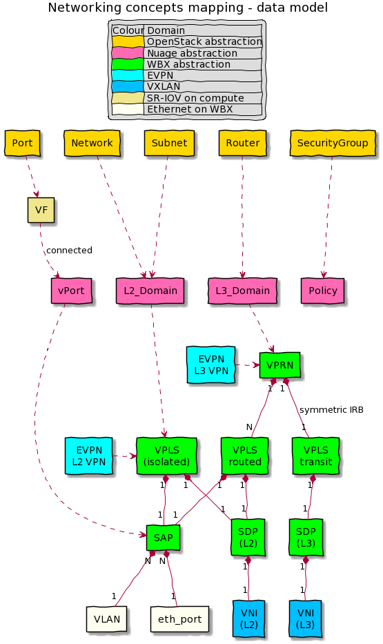

# EVPN VXLAN abstractions
 
This graph presents different abstractions layers and their relationships
for EVPN VXLAN netwroking with 
* Nokia WBX - configuration objects
* Nuage - VSD API objects
* OpenStack - Neutron API objects

Generated on https://www.planttext.com/

 
