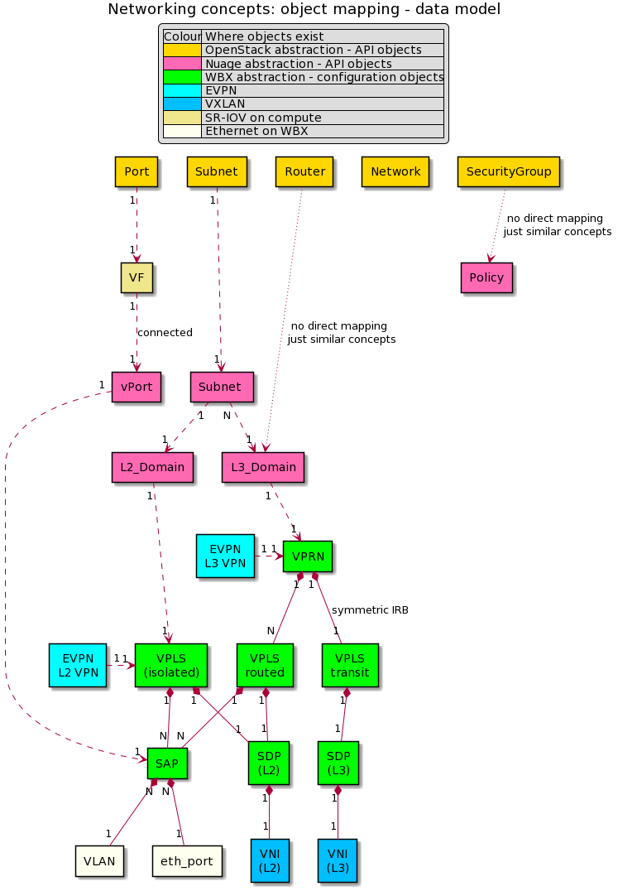

# VXLAN abstractions
 
This graph presents different abstractions layers and their relationships
for EVPN VXLAN netwroking with Nokia WBX, Nuage and OpenStack.

Generated on https://www.planttext.com/

 
